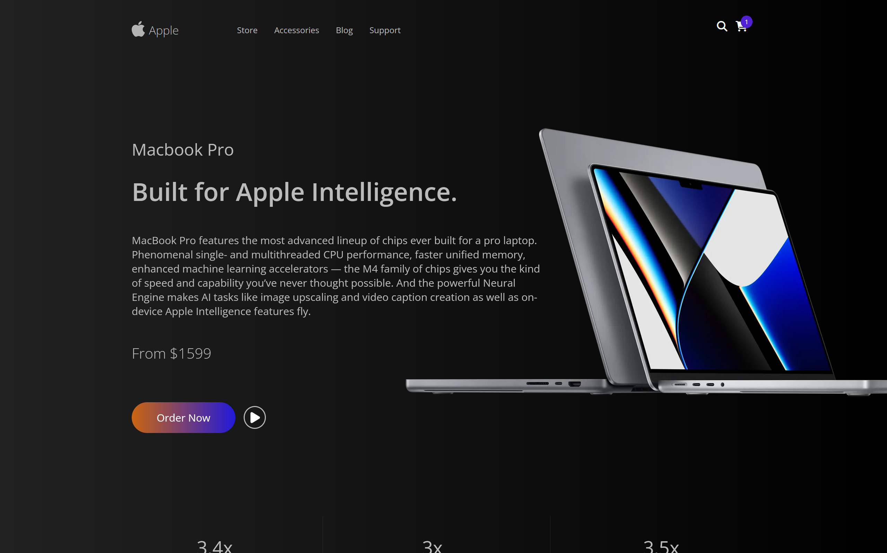

# Apple Store UI

This is a responsive clone of the Apple Store landing page, built with HTML and CSS. The design focuses on capturing the sleek, modern aesthetic of Apple's official website, with interactive elements and clean visual structure.

## 🌐 Live Demo

👉 [View Live Site](https://dani-sink.github.io/apple-store-ui/)

## 🛠 Features

- Responsive layout for desktop and mobile.
- Hero section with promotional content.
- Product highlight banners.
- Consistent Apple-style typography and spacing
- Navigation and footer structure inspired by the official Apple website

## 📁 Technologies Used

- **HTML5** — semantic structure
- **CSS3** — custom styles, flexbox, and responsive design

## 📸 Screenshot



## 🚀 Getting Started

1. Clone the repository:
   ```bash
   git clone https://github.com/dani-sink/apple-store-ui.git
   ```
2. Navigate to the project folder:
   ```bash
   cd apple-store-ui
   ```
3. Open `index.html` in your browser or run with a local server (e.g., Live Server in VS Code).

## 📱 Responsive Design

This project is fully responsive and adapts to screens of all sizes, ensuring a consistent user experience across devices.

## 🧠 Inspiration

Inspired by the [Apple.com](https://www.apple.com/) homepage and its minimal, high-impact product marketing layout.

## 👤 Author

**Jean-Daniel Sinkpon**  
[Portfolio](https://dani-sink.github.io/my-first-portfolio/) • [GitHub](https://github.com/dani-sink) • [LinkedIn](https://linkedin.com/in/daniel-sinkpon)

---

> ⭐ If you like this project, feel free to star the repo or contribute!
